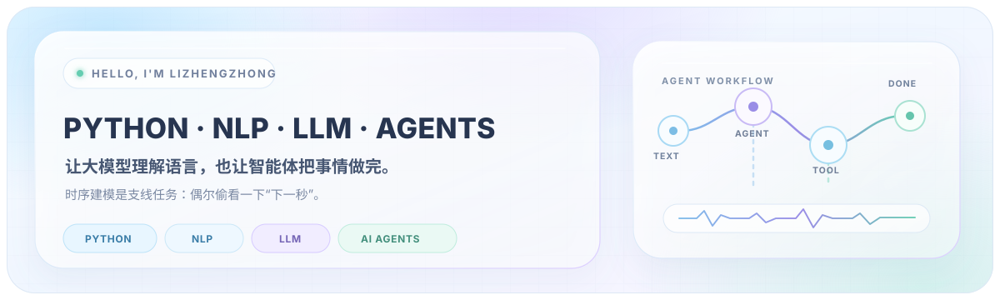
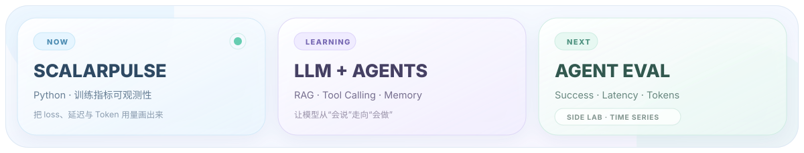

  

  你好，我是 Lizhengzhong。平时和文本、模型、Agent 打交道： 
  希望模型不只会回答问题，也能记住上下文、调用工具，最后把事情做完。 
  偶尔研究时序——毕竟除了模型的下一句话，人也总想知道下一秒会发生什么。

  

## 👋 关于我

我正在沿着 **NLP × AI Agents** 这条路学习和构建。比起把技术名词排成一堵墙，我更喜欢做一个真的能点、能跑、能复现的小项目——最好 README 还能让第一次来的朋友顺利跑起来。

现在以 **Python** 为主要工具，关注自然语言处理、智能体工作流与实验可观测性；Linux、C 和系统编程经验则是我的工程底座。

> 我的关注路径：先让模型理解语言，再让 Agent 开始行动，最后盯着指标看看它有没有认真干活。

## 🧭 我在折腾什么

| 🧠 自然语言处理 · 核心 | 🤖 智能体系统 · 核心 | 📈 时序建模 · 探索 |
| --- | --- | --- |
| 文本理解、语义检索、生成与评估 | 任务规划、工具调用、记忆与工作流 | 预测、异常检测与时序特征 |
| 关注从模型能力到实际 NLP 应用 | 关注可运行、可观察、可评估的 Agent | 用小实验理解时间信号与变化规律 |

## 🚀 精选项目

### [ScalarPulse](https://github.com/lizhengzhong20-sketch/scalarpulse) · 让训练过程实时可见

ScalarPulse 是一个轻量级、本地优先的模型训练指标可视化工具。它不负责训练模型，而是把训练过程照亮。

  
  
  

- 实时观察 loss、accuracy、学习率与任意标量。
- 可接入 PyTorch，也适用于普通 Python 训练循环。
- 使用本地 JSONL 保存实验，支持历史 run、SSE 实时更新与 CSV 导出。
- 零核心运行时依赖，安装后即可启动浏览器仪表盘。

**[查看源码](https://github.com/lizhengzhong20-sketch/scalarpulse)** · **[中文文档](https://github.com/lizhengzhong20-sketch/scalarpulse/blob/main/README.zh-CN.md)** · **[快速开始](https://github.com/lizhengzhong20-sketch/scalarpulse#quick-start)**

## 🧰 随身工具箱

  
  
  
  
  

## 🔭 当前任务队列

- [x] 发布 ScalarPulse 的第一个可用版本。
- [ ] 用小型项目验证 NLP 的核心方法。
- [ ] 做一个会规划、会调用工具、而且能被评估的 Agent。
- [ ] 让 ScalarPulse 更方便地观察 NLP、Agent 与时序实验。
- [ ] 从简单任务开始探索时序预测与异常检测。

<strong>🧪 展开查看开发者运行日志</strong>

 

- 对“先跑起来，再慢慢变漂亮”有一点执念。
- 看到 loss 稳定下降会开心；看到 Agent 一次把工具调对，会更开心。
- Debug 的时候经常先怀疑模型，最后发现是自己少写了一个参数。
- 喜欢小而清楚的工具，也相信好文档是功能的一部分。

---

  让模型听懂，让 Agent 动手；如果哪里不对，就打开 ScalarPulse 看看。

