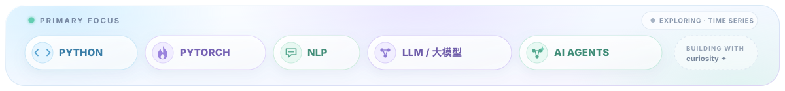
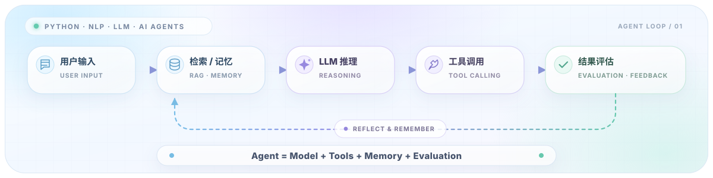
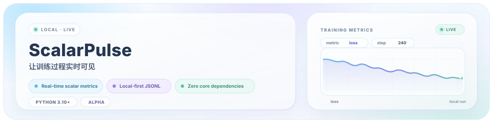

  

  你好，我是 Lizhengzhong。我的主线很明确：用 Python 做 NLP、大语言模型和智能体。 
  希望模型不只会回答问题，也能记住上下文、调用工具，最后把事情做完。 
  时序建模是偶尔探索的支线——毕竟除了模型的下一句话，人也总想知道下一秒会发生什么。

  

## 👋 关于我

我正在沿着 **Python × NLP × LLM × AI Agents** 这条路学习和构建。比起把技术名词排成一堵墙，我更喜欢做一个真的能点、能跑、能复现的小项目——最好 README 还能让第一次来的朋友顺利跑起来。

> **输入：** 一段自然语言　·　**目标：** 一件真正被完成的事　·　**中间过程：** 模型、记忆、工具与评估

PyTorch 和实验可观测性工具，是我把想法变成项目的主要工程支撑。看到 loss 稳定下降会开心；看到 Agent 一次把工具调对，会更开心。

  

## 🤖 我怎样理解一个 Agent

我喜欢的 Agent 不是“把同一句提示词多跑几遍”，而是能理解任务、寻找上下文、调用工具，并知道结果是否靠谱的完整工作流。

  

## 🚀 精选项目

ScalarPulse 是一个轻量、本地优先的 Python 训练指标看板。它不负责训练模型，而是把训练过程照亮：loss、F1、学习率、延迟、Token 用量和任意标量都可以实时画出来。

  <a href="https://github.com/lizhengzhong20-sketch/scalarpulse"><strong>查看源码</strong></a>
  ·
  <a href="https://github.com/lizhengzhong20-sketch/scalarpulse#readme"><strong>中文文档</strong></a>
  ·
  <a href="https://github.com/lizhengzhong20-sketch/scalarpulse#30-%E7%A7%92%E4%BD%93%E9%AA%8C"><strong>30 秒体验</strong></a>
  ·
  <a href="https://github.com/lizhengzhong20-sketch/scalarpulse/actions/workflows/tests.yml"><strong>CI 状态</strong></a>

<strong>📊 展开查看真实仪表盘</strong>

 

<strong>🧭 当前任务队列</strong>

 

- [x] 发布 ScalarPulse 的第一个可用版本。
- [x] 把项目文档改成中文主文档，让第一次来的朋友更容易跑起来。
- [ ] 用小型项目验证 NLP 与大语言模型的核心方法。
- [ ] 做一个会规划、会调用工具、而且能被评估的 Agent。
- [ ] 用 ScalarPulse 观察 Agent 的成功率、延迟与 Token 用量。
- [ ] 从简单任务开始探索时序预测与异常检测。

<strong>🧪 开发者运行日志</strong>

 

- 对“先跑起来，再慢慢变漂亮”有一点执念。
- Debug 时经常先怀疑模型，最后发现是自己少写了一个参数。
- 喜欢小而清楚的工具，也相信好文档是功能的一部分。
- 正在努力把“它理论上可以”改成“你现在就能跑”。

---

  让模型听懂，让 Agent 动手；如果哪里不对，就打开 ScalarPulse 看看。

